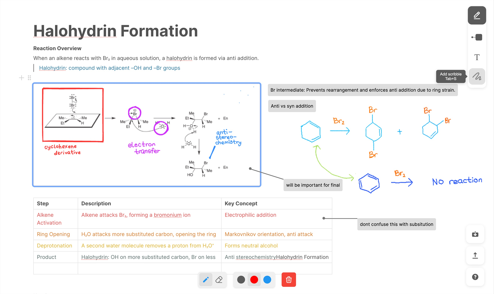
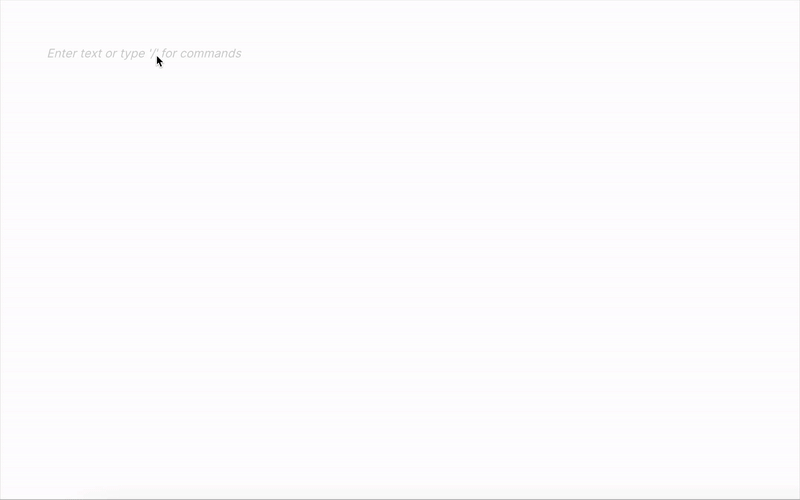
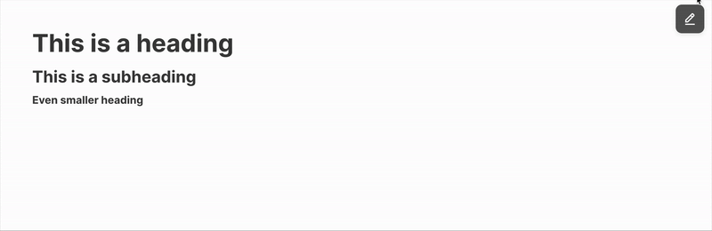
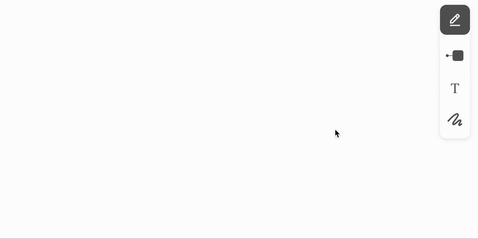
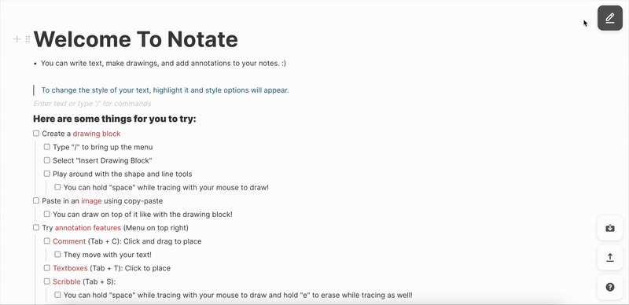
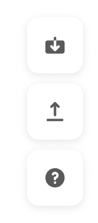

# Notate: Blending Visual and Textual Notetaking

A lightweight, minimalist text editor designed to make integrating annotations and visuals easier—perfect for visual notetakers seeking a smoother experience on platforms that traditionally struggle with rich note-taking.



[View our poster](readme/poster.pdf)

Created by Cheryl Wu, Huixi Lee, Roland Yang, and Sean Chan for UCLA's CS188: Human-Computer Interaction Class.

## Getting Started
```shell
npm i
npm install @blocknote/core @blocknote/react @blocknote/mantine
npm run dev
```

You may also use the live website: [notetaking-hci-app.vercel.app](notetaking-hci-app.vercel.app)

## Features

### Textual Editor

A minimal rich block text editor that supports basic formatting for clean and inutitive note-taking.

### Drawing Canvas

A freeform canvas for sketching, annotating, and visualizing ideas with flexible drawing tools (Brush/Pen, Eraser, Line, Arrow, Rectangle/Square, Circle, Text, Brush Size, Colors).

Can be inserted by typing `/` and choosing the first option for insert drawing.


### Direct Image Paste

Easily paste images directly from your clipboard into the editor and be able to annotate and draw on it with the same tools as a normal drawing canvas. Also supports file upload.

Can be activated by typing `/` and choosing the option for insert image but you can also directly paste an image from your clipboard or drag and drop an image from your system.



### Spacebar Draw

To combat the clunkiness of having to hold down the trackpad on keyboards while drawing, you can hold down spacebar and trace with your mouse to draw for ease of annotation and drawing.

### Drag and Drop Comments

Add movable comments onto a specific block or part of the canvas by clicking and dragging from the location to create a comment box at that point.

Can be activated by pressing `Tab + C` or accessing the feature from the external annotations menu in the top right.



### Drag and Drop Text Box

Place movable text boxes freely on the canvas.

Can be activated by pressing `Tab + T` or accessing the feature from the external annotations menu in the top right.



### Scribble Tool

Use the scribble tool to draw casual, freehand strokes and markup on the *entire* file editor (even outside of blocks) that mimic real pen or pencil input.

Can be activated by pressing `Tab + S` or accessing the feature from the external annotations menu in the top right.



### Import/Export

Seamlessly import or export your work as JSON files to save progress or share across platforms. 

Done in JSON format to preserve the annotations data so when you import it back in you have all the same exact editable annotations/drawings and you can may edit them as well.

Can be activated by utilizing the import/export menu in the bottom right.

